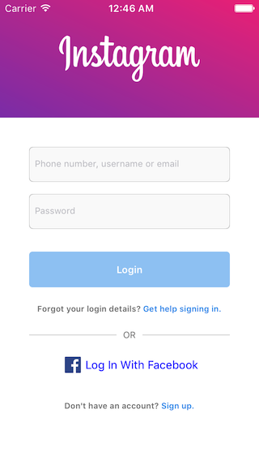

# Form

[](https://travis-ci.org/guarani/Form)
[](http://cocoapods.org/pods/Form)
[](http://cocoapods.org/pods/Form)
[](http://cocoapods.org/pods/Form)


## Usage

### How to create a form


## Instagram Example

To run the example project, clone the repo, and run `pod install` from the Example directory first.

Using this library, we can create the following layout. (I use `Pastel` and `ActiveLabel` for demo purposes.)




## Instagram Example Code

```swift
import UIKit
import Form
import Pastel
import ActiveLabel


class InstagramSignInViewController: UIViewController {

    let label = ActiveLabel()
    
    override var preferredStatusBarStyle: UIStatusBarStyle {
        return .lightContent
    }
    
    override func viewDidLoad() {
        super.viewDidLoad()

        setNeedsStatusBarAppearanceUpdate()

        Form(in: self, constructor: { form in
            
            // Add the instagram pastel header.
            let instaView = InstagramView(frame: self.view.bounds)
            form.add(view: instaView)
            instaView.widthAnchor.constraint(equalTo: self.view.widthAnchor).isActive = true
            instaView.heightAnchor.constraint(equalToConstant: 145).isActive = true
            
            Input(form: form).placeholder("Phone number, username or email").style { input in
                input.textField.font = UIFont.systemFont(ofSize: 11)
            }.bind(.formOnSubmit, .nonempty, .shake).top(36).horizontal(36).height(43).bottom(0).style {
                $0.contentView.backgroundColor = UIColor.foreground
                $0.contentView.layer.cornerRadius = 4
                $0.contentView.layer.masksToBounds = true
                $0.contentView.layer.borderColor = UIColor.border.cgColor
                $0.contentView.layer.borderWidth = 1 / UIScreen.main.scale
            }

            Input(form: form).placeholder("Password").secure(true).style { input in
                input.textField.font = UIFont.systemFont(ofSize: 11)
            }.bind(.formOnSubmit, .nonempty, .shake).top(15).horizontal(36).height(43).bottom(20).style {
                $0.contentView.backgroundColor = UIColor.foreground
                $0.contentView.layer.cornerRadius = 4
                $0.contentView.layer.masksToBounds = true
                $0.contentView.layer.borderColor = UIColor.border.cgColor
                $0.contentView.layer.borderWidth = 1 / UIScreen.main.scale
            }
            
            Button(form: form).title("Login").style { button in
                button.button.backgroundColor = .blue
                button.button.layer.cornerRadius = 4
                button.button.layer.masksToBounds = true
                button.contentView.backgroundColor = .disabled
                button.button.titleLabel?.font = UIFont.boldSystemFont(ofSize: 12)
            }.bind(.formOnChange) { loginButton in
                print(form.isValid)
                loginButton.contentView.backgroundColor = form.isValid ? .enabled : .disabled
            }.height(44).horizontal(36).bottom(20)
            
            
            let signinLabel = LinkLabel(title: "Forgot your login details? Get help signing in.", pattern: "\\Q Get help signing in.\\E", handler: {
                print("Sign in.")
            })
            signinLabel.font = UIFont.boldSystemFont(ofSize: 10)
            form.add(view: signinLabel)
            
            Separator(form: form).title("OR").style {
                $0.label?.textColor = .gray
                $0.label?.font = UIFont.systemFont(ofSize: 11)
            }.horizontal(36).vertical(20)
            

            form.add(view: FacebookButton())

            
            let signupLabel = LinkLabel(title: "Don't have an account? Sign up.", pattern: "\\Q Sign up.\\E", handler: {
                print("Sign up")
            })
            signupLabel.font = UIFont.boldSystemFont(ofSize: 10)
            signupLabel.heightAnchor.constraint(equalToConstant: 80).isActive = true
            form.add(view: signupLabel)

        }).navigation(true)
    }
    
    override func touchesBegan(_ touches: Set<UITouch>, with event: UIEvent?) {
        super.touchesBegan(touches, with: event)
        self.view.endEditing(true)
    }
}


```

## Requirements

## Installation

Form is NOT YET available through [CocoaPods](http://cocoapods.org). To install
it, simply add the following line to your Podfile:

```ruby
pod "Form", :git => 'https://github.com/roshkadev/Form.git'
```

## Author

guarani, pvonschrottky@roshka.com

## License

Form is available under the MIT license. See the LICENSE file for more info.
